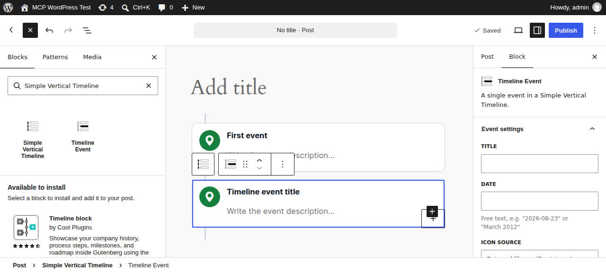
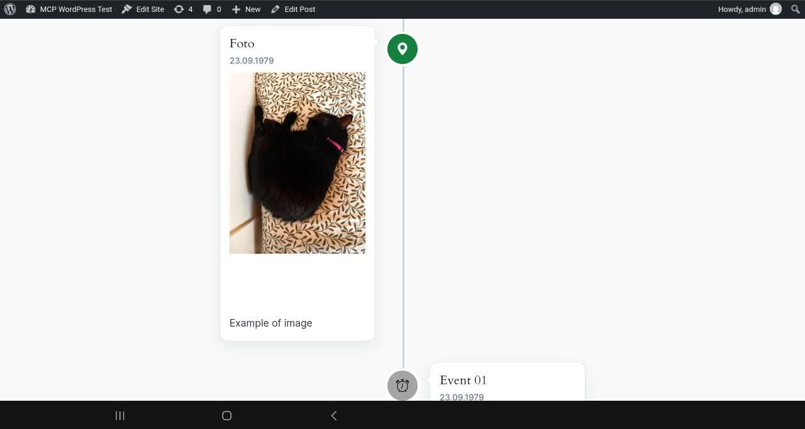
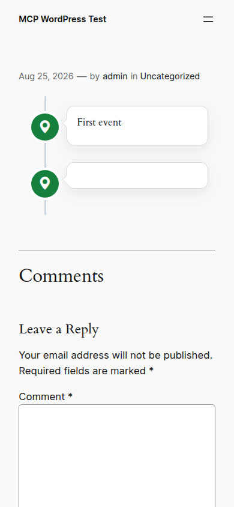

# Simple Vertical Timeline

Create a Simple Vertical Timeline in your WordPress posts and pages.

[](https://wordpress.org/plugins/simple-vertical-timeline/) [](https://wordpress.org/plugins/simple-vertical-timeline/) [](https://wordpress.org/plugins/simple-vertical-timeline/)

## Description

Simple Vertical Timeline lets you build vertical timelines in posts and pages with Gutenberg blocks.

### Block Editor (recommended)

Add the **"Simple Vertical Timeline"** block, then insert **"Timeline Event"** blocks inside it.

Each event supports:
- Title and date
- Icon source: Bootstrap Icons library or custom image URL
- Title CSS class and Date CSS class
- Icon color and icon circle background color
- Rich content (paragraphs, images, lists, and more)

### Classic Editor fallback

The legacy shortcodes still work for backward compatibility:

```
[svtimeline]
  [svt-event title="First Event" date="2026-01-01" class="svt-cd-green"]
    Event description here...
  [/svt-event]
[/svtimeline]
```

## Quick start

1. Create or edit a Post/Page
2. Click **+** (Block Inserter)
3. Search for **"Simple Vertical Timeline"** and insert it


4. Click **+** inside the timeline to add your first **Timeline Event**
5. Fill the event details in the sidebar
6. Write the event description directly in the block

## Screenshots

1. Block inserter search result.


2. Add an event to the current SVT and configure all "Event settings" fields; event body supports any content.



3. Timeline editor canvas with multiple events, image content, marker icons, and date/title preview.



4. Frontend responsive timeline (mobile).



## Installation

### Integrated WordPress plugin installer

* Go to Plugins > Add New
* Search for `Simple Vertical Timeline`
* Click Install Now, then Activate

### Manual method

* Upload `simple-vertical-timeline` folder to `/wp-content/plugins/`
* Activate through the `Plugins` menu

## Development

```bash
npm install
npm run build   # production build
npm run start   # watch mode
```

Blocks are in `blocks/src/`, compiled to `blocks/build/` (committed for SVN deploy).

## Credits

Copyright 2012-2026 Alessandro Staniscia (alessandro@staniscia.net)

License: GPLv2

Icons: https://linearicons.com/free/license
